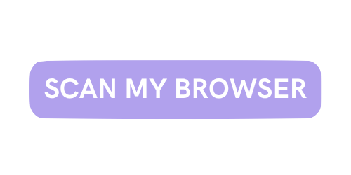
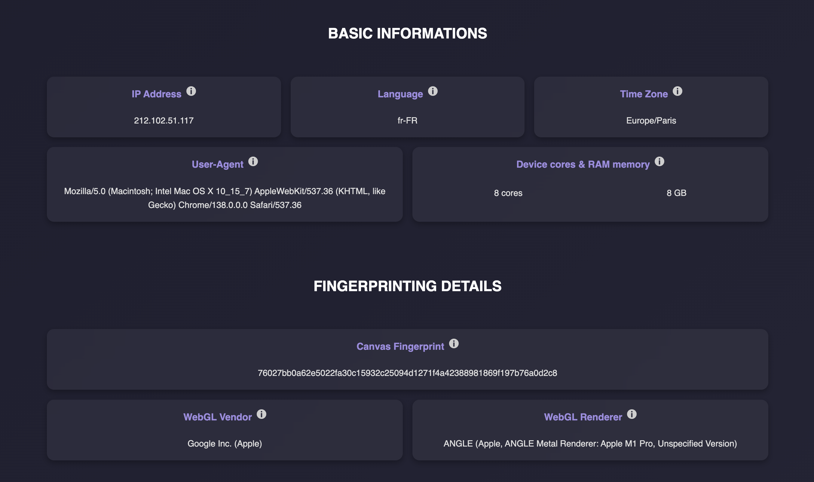
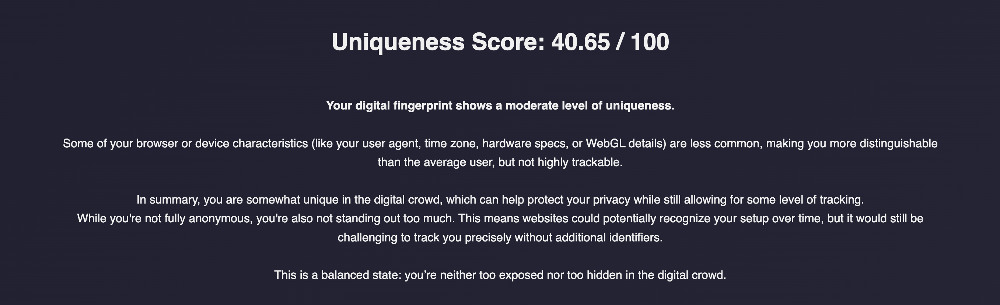
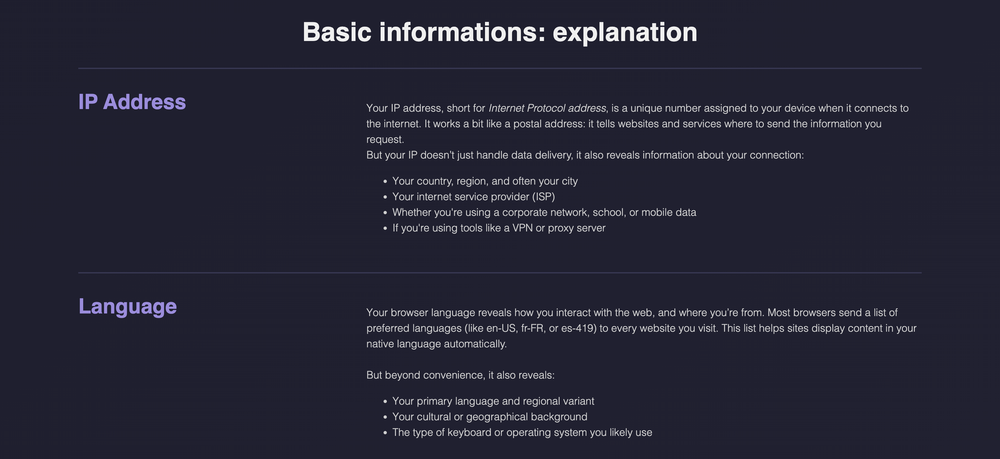
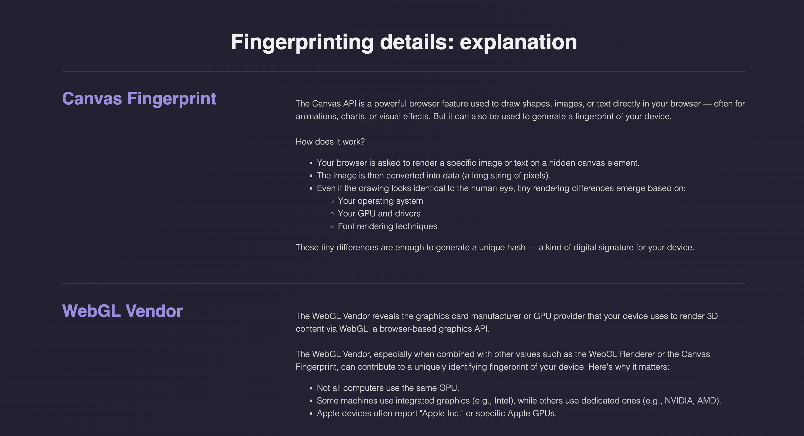
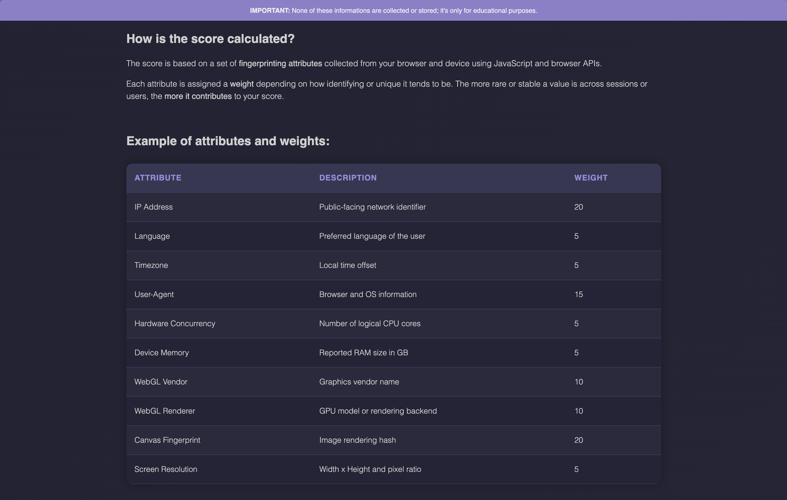

  

Unmasked is a lightweight web tool that reveals what your browser silently exposes about you. It displays detailed client-side information like your system configuration, screen size, browser fingerprint, and more. 

 
The goal: raise awareness about passive tracking and show how unique / traceable your digital identity really is.

 

  

 

  <a href="#description">Description</a> •
  <a href="#features">Features</a> •
  <a href="#utilisation">Utilisation</a> •
  <a href="#demonstration">Demonstration</a>

 

## Description

Unmasked is a lightweight and beginner-friendly web tool designed to reveal what modern browsers silently expose about users.

Its goal is to help identify how unique and traceable a device can be based on client-side information like screen size, system language, browser details, and advanced fingerprinting techniques — all without using cookies or active tracking.

Originally created as a learning project to explore JavaScript, browser APIs, and privacy concepts, Unmasked now serves as a useful base for anyone who wants to:

- Understand how digital fingerprinting works in real-world browsers
- Raise awareness about passive data leaks and tracking
- Practice building full-stack privacy tools using JavaScript and Python

 

You can check the application at this address : <a href="https://rikoriken.github.io/Unmasked/">rikoriken.github.io/Unmasked</a>

 

## Features

### 1️⃣ Fingerprint Scan

- ✅ One-click scan of your browser and device attributes
- ✅ Fully client-side: all data is processed in the browser
- ✅ Real-time analysis, no personal data stored
 

### 2️⃣ Uniqueness Score

- ✅ Calculates a score from 0 to 100 based on the uniqueness of your configuration
- ✅ Breakdown of each factor contributing to the score
 

### 3️⃣ Detailed Insight

A clear information for each data point is given : 
- IP Address
- Timezone
- Language
- User-Agent
- Number of Cores
- Device Memory
- WebGL Vendor & Renderer
- Canvas Fingerprint
 

### 4️⃣ Informative “About” Page

- ✅ Educates users on browser fingerprinting risks
- ✅ Offers detailed documentation of each fingerprinting technique
 

## Utilisation

 
 

## Demonstration

### Simple utilisation of the scan process <a href="https://rikoriken.github.io/Unmasked/">(view application)</a>

https://github.com/user-attachments/assets/882246d6-f178-473e-87a4-5e769a976fe9

 

### SCAN PAGE : Zoom on Basic Informations & Fingerprinting details <a href="https://rikoriken.github.io/Unmasked/scan.html">(view page)</a>

### SCAN PAGE : Zoom on Uniqueness Score <a href="https://rikoriken.github.io/Unmasked/scan.html">(view page)</a>

### ABOUT PAGE : Zoom on Basic Informations Explanations <a href="https://rikoriken.github.io/Unmasked/about.html">(view page)</a>

### ABOUT PAGE : Zoom on Fingerprinting Details Explanation <a href="https://rikoriken.github.io/Unmasked/about.html">(view page)</a>

### ABOUT PAGE : Zoom Uniquenesss Score Calculation <a href="https://rikoriken.github.io/Unmasked/about.html">(view page)</a>

